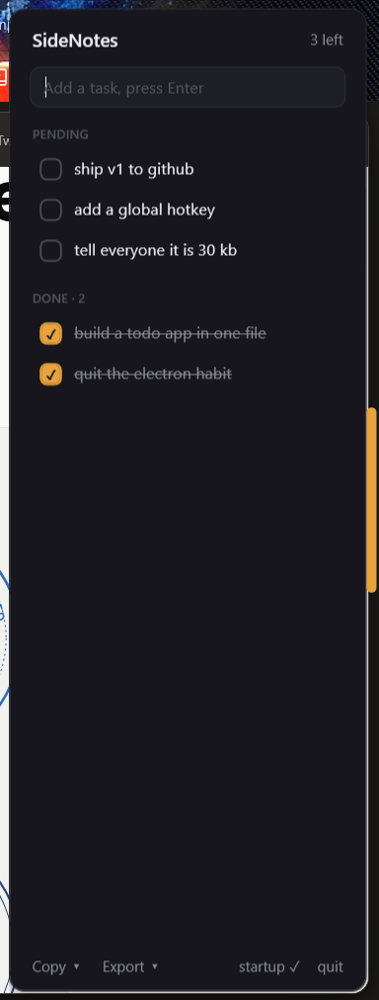

<div align="center">
<pre>
     _     _                  _
 ___(_) __| | ___ _ __   ___ | |_ ___  ___
/ __| |/ _` |/ _ \ '_ \ / _ \| __/ _ \/ __|
\__ \ | (_| |  __/ | | | (_) | ||  __/\__ \
|___/_|\__,_|\___|_| |_|\___/ \__\___||___/
</pre>

**a todo list that lives on the edge of your screen. literally.**



*the entire app. there is no window 2.*

</div>

---

## the problem

Every todo app dies the same death. It lives behind a tab, behind a login,
behind a sync spinner. You alt-tab to it with good intentions, and by the time
it loads you've forgotten what you came for. Three weeks later it's a graveyard
with a subscription fee.

SideNotes takes a different deal: **it gives up all of your screen except ten
pixels.** A thin amber stripe on the edge. Click it — the panel slides in.
Type, Enter, done. Click anywhere else — it slides back out and you're looking
at your work again. The todo list is never more than one click away and never
in your way. That's the whole trick.

---

## the numbers

| | |
|---|---|
| source files | **1** (`SideNotes.cs`) |
| dependencies | **0** |
| binary size | **~30 KB** |
| runtimes to download | **0** — compiles with the C# compiler already inside Windows |
| accounts, clouds, subscriptions | **0** |
| electrons harmed | **0** |

Thirty kilobytes. That is smaller than the favicon of most todo apps'
landing pages.

---

## the loop

```
      click stripe          type + Enter          click the row
   ┌───────────────┐     ┌───────────────┐     ┌───────────────┐
   │  panel slides │ ──▶ │  todo appears │ ──▶ │ moves to DONE │
   │      in       │     │  · saved to   │     │ strikethrough │
   └───────────────┘     │  disk already │     └───────────────┘
                         └───────────────┘
   click anywhere else → slides away. that's it. that's the app.
```

Every change hits the disk the moment it happens. Shut down, restart,
bluescreen mid-keystroke — your list comes back exactly as you left it.
There is no save button because there is nothing to save. It already is.

---

## what it does

- **click anywhere on a row** to mark it done — it drops to the DONE section
  with a strikethrough. Click again to resurrect it.
- **hover a row** → ✕ to delete, tooltip shows when it was added and when
  it was finished. Every todo carries its full history.
- **Copy ▾** — all / pending / done straight to your clipboard as markdown.
- **Export ▾** — same three cuts, to a `.md` file, timestamps included.
- **drag the stripe** to the left edge if you're a left-edge person. It
  remembers.
- **startup** toggle in the footer — one click and it's there every boot.
- **Esc** closes. Launching it twice does nothing (single instance).

---

## get it

```bat
git clone https://github.com/codewithfourtix/sidenotes.git
cd sidenotes
build.bat
SideNotes.exe
```

No SDK. No npm install. No "downloading 400 MB of runtime". The compiler
(`csc.exe`) has been sitting inside every Windows install since 2010,
waiting for this moment.

---

## your data

Everything lives in `%APPDATA%\SideNotes\` as plain text you can open in
Notepad:

```
notes.txt    →  P  <added-ticks>  <done-ticks>  buy milk
config.txt   →  right
```

Not in a cloud. Not in a database. Not in somebody's Series A pitch deck.
A text file, on your machine, that you can grep.

---

<div align="center">

built in one evening · one file · zero dependencies
**[Fourtix](https://github.com/codewithfourtix)**

</div>
