<div align="center">



<br/>


<br/>
<br/>

**`1 file` · `0 dependencies` · `25 KB` · `no runtime to download`**

</div>

---

A thin amber stripe on the edge of your screen. Click it — a panel slides in.
Type a todo, hit Enter, click anywhere else and it's gone again. Your whole
screen stays yours, and your list is never more than one click away.

Click any row to mark it done. Everything is written to disk the instant it
happens — shut down, restart, bluescreen mid-keystroke, your list comes back
exactly as it was.

---

## get it

```bat
git clone https://github.com/codewithfourtix/sidenotes.git
cd sidenotes
build.bat
SideNotes.exe
```

No SDK, no npm, no 400 MB runtime. It compiles with `csc.exe` — the C# compiler
that's been sitting inside every Windows install since 2010, waiting for this.

## drive it

| you do | it does |
|---|---|
| click the stripe | panel slides in, keyboard ready |
| type + `Enter` | todo added, already saved |
| click a row | done ✓ — drops to DONE, strikethrough |
| click it again | back from the dead |
| hover a row | ✕ to delete · tooltip shows added/done times |
| `Copy ▾` / `Export ▾` | all / pending / done → clipboard or `.md`, timestamps included |
| drag the stripe | dock it on the left edge instead — it remembers |
| `startup` in the footer | there on every boot |
| `Esc` / click away | slides out of your life until you need it |

## your data

Plain text in `%APPDATA%\SideNotes\` — readable in Notepad, greppable,
yours. Not in a cloud, not in a database, not in somebody's pitch deck.

---

<div align="center">

**[Fourtix](https://github.com/codewithfourtix)** · built in one evening, one file

</div>
